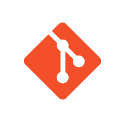

# Qadeer Ullah
### Software Engineeringer
 

  
  
  

 

### Love to code

  
  
  
  
  
  
  
  
  
  
  
  
  
  

### Favourite Tools

### About
I'm Qadeer Ullah, a MERN (MongoDB, ExpressJS, ReactJS, NodeJS) stack + NextJS developer with 1 years of experience building full-stack web applications. Research & development, teaching, community leading is the top most noticeable skill inside me.

### Working Area

# 1. Web Development:
Building responsive and scalable web applications using HTML, CSS, JavaScript, and frameworks like React, Angular, and Vue.
2. 
3. 
4. 
5. 
6. 
7. 

<table>
<tbody>

<tr>
<td>

</td>

<td>

</td>
</tr>

</tbody>
</table>

